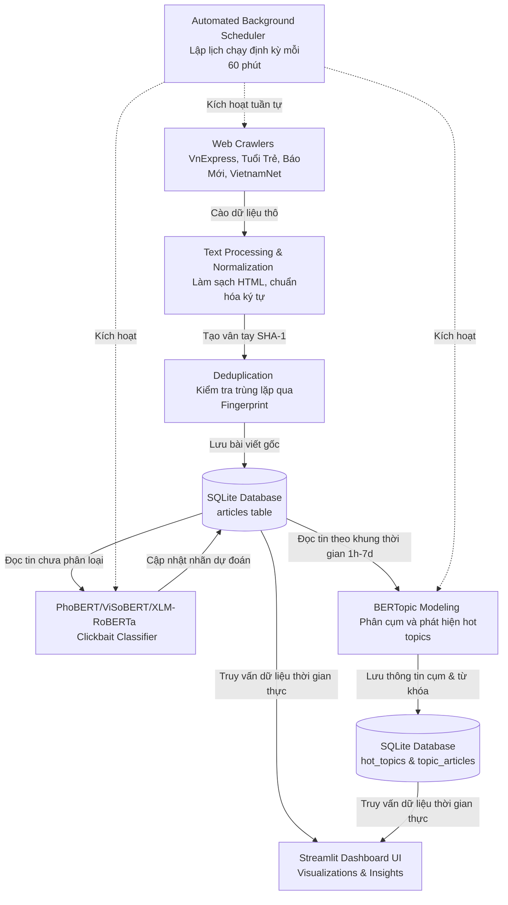

# ĐỀ CƯƠNG CHI TIẾT BÁO CÁO ĐỒ ÁN CHUYÊN NGÀNH 1
**Đề tài:** Hệ thống Thu thập, Phân tích Tin tức tiếng Việt thời gian thực tích hợp Nhận diện Clickbait và Mô hình hóa Chủ đề (AI-Powered Vietnamese News Analysis & Clickbait Detection)

---

## 📋 THÔNG TIN CHUNG VÀ THỦ TỤC HÀNH CHÍNH
*(Các trang này nằm ở đầu báo cáo theo chuẩn định dạng của Nhà trường)*
1. **Trang bìa chính & Trang bìa phụ**: Tên Trường/Khoa, Tên đề tài, Giáo viên hướng dẫn, Sinh viên thực hiện (Họ tên, MSSV, Lớp), Địa danh & Năm học.
2. **Trang Lời cam đoan**: Cam kết tính trung thực của đề tài, các nguồn trích dẫn và kết quả tự phát triển.
3. **Trang Lời cảm ơn**: Tri ân Giáo viên hướng dẫn, Nhà trường, Khoa và bạn bè/gia đình đã hỗ trợ trong quá trình thực hiện đồ án.
4. **Trang Mục lục**: Trình bày danh mục các chương, mục chính kèm số trang tương ứng.
5. **Danh mục chữ viết tắt**: Định nghĩa các thuật ngữ viết tắt trong đồ án (ví dụ: NLP, BERT, c-TF-IDF, ORM, UI, CPU, GPU,...).
6. **Danh mục bảng biểu**: Liệt kê số thứ tự, tên bảng và trang của tất cả bảng số liệu.
7. **Danh mục hình vẽ**: Liệt kê số thứ tự, tên hình ảnh, biểu đồ, sơ đồ và trang tương ứng.

---

## 🌟 LỜI MỞ ĐẦU
1. **Bối cảnh thực tế**:
   * Sự bùng nổ thông tin trên internet và mạng xã hội. Báo chí điện tử Việt Nam trở thành kênh tiếp cận thông tin thiết yếu hàng ngày của người dân.
   * Vấn nạn "Clickbait" (tin giật tít câu view, giật gân, sai lệch nội dung) ngày càng gia tăng, gây ảnh hưởng tiêu cực tới trải nghiệm người đọc và làm suy giảm uy tín của các cơ quan báo chí chính thống.
2. **Sự cần thiết của đề tài**:
   * Cần có một hệ thống tự động, liên tục thu thập tin tức đa nguồn để giúp người dùng nắm bắt thông tin nhanh chóng.
   * Cần ứng dụng các mô hình ngôn ngữ lớn (Học sâu/Transformer) nhằm tự động nhận diện và cảnh báo tin tức clickbait một cách chính xác trước khi người dùng click vào.
   * Cần tự động gom cụm và phát hiện các chủ đề nóng (trending/hot topics) để cung cấp cái nhìn toàn cảnh về dòng chảy tin tức.
3. **Mục tiêu của Đồ án**: Xây dựng thành công hệ thống đầu-cuối (end-to-end): tự động thu thập tin tức, tiền xử lý, phân loại clickbait bằng mô hình học sâu học chuyển giao, gom cụm chủ đề bằng BERTopic, và trực quan hóa qua Dashboard tương tác cao cấp.

---

## 📚 CHƯƠNG 1: TỔNG QUAN VÀ CƠ SỞ LÝ THUYẾT

### 1.1. Tổng quan về Đề tài
* **Đối tượng nghiên cứu**: Các bài báo điện tử tiếng Việt từ các nguồn báo uy tín (VnExpress, Tuổi Trẻ, Báo Mới, VietnamNet).
* **Phạm vi nghiên cứu**:
  * Các tiêu đề bài viết tiếng Việt dùng để phân loại Clickbait.
  * Toàn bộ tiêu đề và tóm tắt bài viết dùng để phân tích chủ đề nổi bật.
  * Các khung thời gian phân tích: 1 giờ, 6 giờ, 12 giờ, 24 giờ, và 7 ngày gần nhất.

### 1.2. Cơ sở lý thuyết về Thu thập và Tiền xử lý dữ liệu
* **Kỹ thuật Web Scraping**: Sử dụng BeautifulSoup và requests để trích xuất cấu trúc HTML tĩnh, Selenium để cào các trang web có nội dung tải động.
* **Tiền xử lý văn bản tiếng Việt**:
  * Chuẩn hóa văn bản Unicode (NFC), chuẩn hóa dấu câu và ký tự đặc biệt.
  * Xử lý khoảng trắng thừa, loại bỏ mã HTML thừa.
  * Kỹ thuật tạo dấu vân tay số (Fingerprinting) bằng hàm băm SHA-1 trên nội dung văn bản chuẩn hóa nhằm thực hiện loại bỏ trùng lặp dữ liệu (Deduplication) hiệu quả trước khi lưu kho.

### 1.3. Cơ sở lý thuyết về Phân loại Clickbait bằng Học sâu (Deep Learning)
* **Kiến trúc Transformer & Cơ chế Attention (Chú ý)**: Nền tảng của các mô hình ngôn ngữ hiện đại thay thế cho RNN/LSTM truyền thống.
* **Mô hình BERT (Bidirectional Encoder Representations from Transformers)**: Cơ chế huấn luyện tự giám sát (Masked Language Model) giúp hiểu ngữ cảnh hai chiều.
* **Các mô hình Pre-trained Language Models áp dụng trong đề tài**:
  1. **PhoBERT (vinai/phobert-base)**: Mô hình BERT chuyên dụng cho tiếng Việt được huấn luyện trên kho ngữ liệu khổng lồ (20GB văn bản tiếng Việt), xử lý xuất sắc các đặc trưng ngữ pháp tiếng Việt.
  2. **ViSoBERT (uitnlp/visobert)**: Mô hình BERT được tối ưu hóa riêng cho ngôn ngữ mạng xã hội tiếng Việt, nhạy bén với các từ lóng, cụm từ giật gân, không trang trọng (rất phù hợp với hành vi giật tít clickbait).
  3. **XLM-RoBERTa (xlm-roberta-base)**: Mô hình đa ngôn ngữ lớn dựa trên kiến trúc RoBERTa, có khả năng học chuyển giao mạnh mẽ và biểu diễn ngữ nghĩa đa dạng.

### 1.4. Cơ sở lý thuyết về Mô hình hóa Chủ đề (Topic Modeling)
* **Tổng quan về BERTopic**: Khung làm việc (Framework) tiên tiến nhất hiện nay cho mô hình hóa chủ đề dựa trên Transformer, khắc phục nhược điểm của LDA truyền thống (LDA thường cho ra các chủ đề rời rạc, khó hiểu).
* **Quy trình hoạt động 5 bước của BERTopic**:
  1. **Sentence Embeddings**: Biến đổi văn bản thành vector mật độ cao bằng Sentence Transformers (sử dụng mô hình đa ngôn ngữ `paraphrase-multilingual-MiniLM-L12-v2`).
  2. **Dimensionality Reduction (Giảm chiều dữ liệu)**: Giảm số chiều của vector embedding bằng thuật toán phi tuyến **UMAP** (Uniform Manifold Approximation and Projection) giúp giữ nguyên cấu trúc không gian cục bộ.
  3. **Clustering (Phân cụm)**: Phân nhóm các văn bản có cùng ngữ nghĩa bằng **HDBSCAN** (Hierarchical Density-Based Spatial Clustering of Applications with Noise) giúp tự động phát hiện số lượng cụm tối ưu và lọc nhiễu bài viết không thuộc cụm nào (outliers).
  4. **Tokenizer & Vectorizer**: Sử dụng `CountVectorizer` để trích xuất túi từ (Bag-of-Words) từ các cụm, kết hợp N-gram (1-3 từ) và bộ lọc Stop words tiếng Việt.
  5. **c-TF-IDF (Class-based TF-IDF)**: Tính toán trọng số từ vựng đặc trưng cho từng cụm chủ đề để trích xuất các từ khóa đại diện rõ nghĩa nhất.
  6. **Fine-tuning Representation**: Ứng dụng mô hình `KeyBERTInspired` để chắt lọc từ khóa sát nghĩa nhất với ngữ cảnh của cả cụm bài viết.

---

## 🛠️ CHƯƠNG 2: PHÂN TÍCH VÀ THIẾT KẾ HỆ THỐNG

### 2.1. Phân tích luồng dữ liệu của Hệ thống (Data Pipeline Architecture)
Hệ thống được thiết kế theo mô hình đường ống tuần hoàn khép kín gồm 7 bước:

### 2.2. Thiết kế Cơ sở dữ liệu (Database Schema Design)
Hệ thống sử dụng cơ sở dữ liệu **SQLite** gọn nhẹ, tối ưu hóa tốc độ đọc ghi local và được ánh xạ qua các lớp Object Relational Mapping (ORM). Sơ đồ gồm 3 bảng chính:

#### 1. Bảng `articles` (Lưu thông tin bài viết và kết quả phân loại)
* `id` (INTEGER, Primary Key, Auto Increment): Mã tăng tự động.
* `article_id` (TEXT, Unique, Not Null): Mã băm SHA-1 của URL bài viết, làm khóa logic.
* `url` (TEXT, Unique, Not Null): Đường dẫn bài viết.
* `source` (TEXT, Not Null): Nguồn cào (`vnexpress`, `tuoitre`, `baomoi`, `vietnamnet`).
* `category` (TEXT): Chuyên mục tin tức (`kinh-doanh`, `thoi-su`, `the-thao`,...).
* `title` (TEXT, Not Null): Tiêu đề bài viết (đầu vào nhận diện Clickbait).
* `summary` (TEXT): Tóm tắt bài viết.
* `content_text` (TEXT): Nội dung văn bản thô đã làm sạch.
* `author` (TEXT): Tác giả bài viết.
* `tags` (TEXT): Các thẻ từ khóa đi kèm bài viết (phân tách bằng dấu phẩy).
* `published_at` (TEXT): Thời gian xuất bản chính thức ("YYYY-MM-DD HH:MM:SS").
* `crawled_at` (TEXT, Not Null): Thời gian hệ thống tiến hành cào ("YYYY-MM-DD HH:MM:SS").
* `content_html_raw` (TEXT): Mã HTML thô của bài viết (phục vụ mục đích gỡ lỗi).
* `fingerprint` (TEXT): Mã băm SHA-1 của `content_text` đã chuẩn hóa (dùng để phát hiện trùng lặp chéo nội dung).
* `predicted_label` (TEXT): Nhãn dự đoán (`clickbait` hoặc `non-clickbait`).
* `prediction_score` (REAL): Điểm số xác suất (confidence score) của dự đoán (từ 0.0 đến 1.0).
* `model_version` (TEXT): Phiên bản hoặc tên mô hình Deep Learning thực hiện dự đoán.
* `labeled_at` (TEXT): Thời gian thực hiện phân loại.
* `created_at` (TEXT): Thời gian tạo bản ghi trong DB.

> [!NOTE]
> Để đảm bảo hiệu năng truy vấn dữ liệu lớn khi hệ thống chạy thực tế, các chỉ mục (Indexes) sau đã được thiết lập:
> * `idx_fingerprint` trên cột `fingerprint` (tăng tốc độ kiểm tra trùng lặp).
> * `idx_crawled_at` và `idx_published_at` (tối ưu truy vấn bài viết theo khung thời gian).
> * `idx_predicted_label` và `idx_labeled_at` (tối ưu hóa hiển thị thống kê clickbait trên giao diện).

#### 2. Bảng `hot_topics` (Lưu thông tin chủ đề nóng được phát hiện)
* `id` (INTEGER, Primary Key, Auto Increment): Mã định danh chủ đề.
* `topic_name` (TEXT, Not Null): Tên hoặc mô tả ngắn gọn của chủ đề (được sinh từ bài viết tiêu biểu tiêu biểu).
* `keywords` (TEXT, Not Null): Danh sách từ khóa đặc trưng (ngăn cách bằng dấu phẩy).
* `article_count` (INTEGER): Số lượng bài viết thuộc chủ đề này.
* `timeframe` (INTEGER): Khung thời gian phân tích tính bằng giờ (1, 6, 12, 24, 168 giờ).
* `created_at` (TEXT): Thời điểm phát hiện chủ đề.

#### 3. Bảng `topic_articles` (Bảng trung gian liên kết Nhiều-Nhiều)
* `topic_id` (INTEGER, Foreign Key liên kết `hot_topics(id)`).
* `article_id` (TEXT, Foreign Key liên kết `articles(article_id)`).
* Khóa duy nhất (UNIQUE) trên cặp `(topic_id, article_id)`.

### 2.3. Thiết kế các Mô-đun chức năng chính
1. **Mô-đun Crawlers (`src/crawlers/`)**: Thiết kế hướng đối tượng với lớp cha `BaseCrawler` định nghĩa các phương thức trừu tượng (abstract methods) và xử lý ngoại lệ chung. Các lớp con `VNExpressCrawler`, `TuoiTreCrawler`, `BaoMoiCrawler`, và `VietnamNetCrawler` kế thừa và triển khai thuật toán bóc tách thẻ HTML đặc thù của từng trang.
2. **Mô-đun Phân loại (`src/models/`)**: Triển khai huấn luyện chuyển giao (Fine-tuning) các mô hình Transformer từ Hugging Face. Lớp `ClickbaitClassifier` chịu trách nhiệm tải trọng số mô hình đã tối ưu, nhận diện bất đồng bộ theo lô (batch inference) để cải thiện tốc độ.
3. **Mô-đun Chủ đề (`src/core/`)**: Cấu hình quy trình BERTopic, lọc bỏ nhiễu tiếng Việt và liên kết các bài báo tương ứng vào cơ sở dữ liệu.
4. **Mô-đun Lập lịch (`src/scripts/sched_run.py`)**: Chạy dưới dạng tiến trình nền (Daemon Process), sử dụng thư viện `schedule` để kích hoạt vòng tuần hoàn: *Cào tin mới -> Làm sạch -> Loại trùng -> Dự đoán Clickbait -> Phân tích chủ đề -> Chờ 60 phút -> Lặp lại*.

---

## 📈 CHƯƠNG 3: TRIỂN KHAI THỰC NGHIỆM VÀ KẾT QUẢ

### 3.1. Tập dữ liệu thực nghiệm (ViClickbait Dataset)
* **Nguồn dữ liệu**: Bộ dữ liệu chuẩn hóa **ViClickbait** dành cho tiếng Việt.
* **Số lượng mẫu**: 3,414 mẫu tiêu đề bài viết.
* **Phân bố nhãn**:
  * Nhãn `Legitimate` (Không phải clickbait): 2,347 mẫu (chiếm 68.8%).
  * Nhãn `Clickbait` (Giật tít câu view): 1,067 mẫu (chiếm 31.2%).
* **Phân chia dữ liệu**: Chia ngẫu nhiên thành **80% huấn luyện (Train set)** và **20% đánh giá (Test set - 683 mẫu)** để kiểm thử hiệu năng chéo một cách độc lập.

### 3.2. Cấu hình huấn luyện mô hình
* **Môi trường phần cứng**: Huấn luyện trên GPU CUDA để tối ưu hóa thời gian.
* **Thuật toán tối ưu**: `AdamW` với tốc độ học (Learning Rate) = $2 \times 10^{-5}$.
* **Hàm mất mát**: `CrossEntropyLoss` cho bài toán phân loại nhị phân.
* **Batch size**: 16 hoặc 32 tùy thuộc vào dung lượng bộ nhớ GPU.
* **Epochs**: Huấn luyện trong 3 - 5 epochs kèm cơ chế lưu mô hình có F1-Score tốt nhất trên tập Validation.

### 3.3. Kết quả đánh giá và So sánh các mô hình phân loại Clickbait
*(Đây là số liệu thực tế được đo đạc trực tiếp từ các file kết quả thực nghiệm trong hệ thống của bạn trên tập Test độc lập gồm 683 mẫu)*

| Chỉ số đánh giá (Metrics) | Mô hình PhoBERT  (`vinai/phobert-base`) | Mô hình ViSoBERT  (`uitnlp/visobert`) | Mô hình XLM-RoBERTa  (`xlm-roberta-base`) |
| :--- | :---: | :---: | :---: |
| **Weighted Precision (Độ chính xác trung bình)** | **0.8298** | 0.7990 | **0.8370** |
| **Weighted Recall (Độ phủ trung bình)** | **0.8331** | 0.8038 | 0.8272 |
| **Weighted F1-Score (F1 trung bình)** | **0.8305** | 0.8001 | **0.8302** |
| **ROC-AUC (Diện tích dưới đường cong)** | 0.8765 | 0.8573 | **0.8848** |
| **Sensitivity (Độ nhạy - Nhận diện Clickbait)** | 0.6808 | 0.6244 | **0.7981** |
| **Specificity (Độ đặc hiệu - Nhận diện Tin chuẩn)** | **0.9021** | 0.8851 | 0.8404 |
| **F1-Score riêng cho nhóm Clickbait** | 0.7178 | 0.6650 | **0.7424** |
| **Số mẫu Clickbait đoán trúng (True Positives)** | 145 / 213 | 133 / 213 | **170 / 213** |
| **Số mẫu Tin chuẩn bị đoán sai (False Positives)** | **46 / 470** | 54 / 470 | 75 / 470 |

#### 📊 Phân tích chuyên sâu kết quả thực nghiệm:
1. **Mô hình PhoBERT (`vinai/phobert-base`)**:
   * Đạt điểm số **F1-Score trung bình cao nhất (83.05%)**. 
   * Điểm mạnh vượt trội nằm ở **Độ đặc hiệu (Specificity = 90.21%)**, tức là mô hình rất ít khi bị nhầm lẫn giữa tin tức chuẩn thành clickbait (chỉ đoán nhầm 46 mẫu trên 470 mẫu tin chuẩn). Điều này cực kỳ quan trọng cho các ứng dụng thực tế để tránh làm phiền hoặc gây hoang mang cho người dùng bằng các cảnh báo sai.
2. **Mô hình XLM-RoBERTa (`xlm-roberta-base`)**:
   * Đạt điểm **ROC-AUC cao nhất (88.48%)** và **Sensitivity cực cao (79.81%)**.
   * Nhận diện được tới **170 trên 213 bài viết clickbait** (chỉ bỏ sót 43 bài). Tuy nhiên, độ đánh đổi là tỷ lệ đoán nhầm tin thường thành clickbait cao hơn PhoBERT (75 mẫu False Positives). Đây là mô hình phù hợp cho các hệ thống kiểm duyệt tin tức khắt khe, chấp nhận thà "bắt nhầm hơn bỏ sót".
3. **Mô hình ViSoBERT (`uitnlp/visobert`)**:
   * Đạt hiệu năng ở mức khá (F1-Score = 80.01%). Nguyên nhân là do ViSoBERT được pre-train chủ yếu trên ngôn ngữ không chính thống của mạng xã hội (Social Media), trong khi tập dữ liệu ViClickbait và các bài viết cào được chủ yếu sử dụng ngôn ngữ báo chí điện tử chính thống hơn.

### 3.4. Kết quả thực nghiệm gom cụm chủ đề nóng (BERTopic)
* **Tham số thiết lập**:
  * Sử dụng UMAP giảm chiều về 5 chiều gốc (`n_components=5`) để giữ khoảng cách ngữ nghĩa.
  * HDBSCAN thiết lập gom cụm tối thiểu 5 bài viết cực kỳ giống nhau (`min_cluster_size=5`), giảm độ nhiễu tối đa.
  * Bộ từ khóa đặc trưng c-TF-IDF kết hợp N-gram (1-3 từ) và loại bỏ stop words tiếng Việt đã giúp hệ thống lọc sạch các từ nối vô nghĩa (như *của, bị, và, tại, là, trong...*) và giữ lại các cụm từ đắt giá đại diện cho sự kiện (ví dụ: *"bóng đá Việt Nam"*, *"giá vàng hôm nay"*, *"ùn tắc giao thông"*).
* **Kết quả hiển thị**: Trích xuất thành công các cụm chủ đề phân tách rõ rệt theo các mốc thời gian linh hoạt (1 giờ, 6 giờ, 12 giờ, 24 giờ, 7 ngày) giúp người dùng thấy rõ dòng chảy tin tức thay đổi như thế nào theo thời gian.

### 3.5. Minh họa Giao diện Dashboard Trực quan (Streamlit)
* **Giao diện Dark Theme**: Tạo cảm giác hiện đại, cao cấp, bảo vệ mắt người dùng.
* **Các trang chức năng chính đã triển khai**:
  1. **Article Feed (Bảng tin)**: Hiển thị các bài viết mới cào dưới dạng thẻ bài viết sang trọng kèm theo badge phân loại Clickbait màu đỏ/xanh nổi bật và điểm xác suất tin cậy.
  2. **Hot Topics View (Chủ đề Nóng)**: Cho phép chọn khung thời gian để xem các cụm sự kiện đang thu hút dư luận xã hội nhất, hiển thị kèm các từ khóa chính và bài viết tiêu biểu nhất của cụm đó.
  3. **Clickbait Stats (Thống kê)**: Cung cấp biểu đồ trực quan hóa tỷ lệ tin bài giật tít câu view theo từng nguồn báo (ví dụ so sánh tỷ lệ clickbait giữa VnExpress, Tuổi Trẻ, Báo Mới, VietnamNet) giúp người dùng nhận biết chất lượng thông tin của từng nguồn báo.
  4. **Search Page (Tìm kiếm)**: Cho phép tìm kiếm bài viết toàn văn (Full-text search) kết hợp bộ lọc nguồn báo và nhãn clickbait.

---

## 🔮 CHƯƠNG 4: ĐÁNH GIÁ VÀ HƯỚNG PHÁT TRIỂN

### 4.1. Đánh giá Đồ án
* **Ưu điểm**:
  * Pipeline dữ liệu hoàn chỉnh, hoạt động hoàn toàn tự động và ổn định nhờ cơ chế lập lịch Daemon Scheduler.
  * Đã thực nghiệm so sánh khoa học giữa 3 mô hình Deep Learning tiên tiến để tìm ra cấu hình tối ưu.
  * Áp dụng thành công các thuật toán xử lý dữ liệu lớn (Deduplication bằng SHA-1 fingerprint) tránh dư thừa tài nguyên lưu trữ.
  * Gom cụm chủ đề thời gian thực linh hoạt, giải quyết tốt bài toán lọc stop-words tiếng Việt.
  * Giao diện Streamlit có độ tương tác cao, thiết kế hiện đại và thân thiện.
* **Hạn chế**:
  * Sử dụng SQLite local nên khó mở rộng khi số lượng bài viết lên tới hàng triệu bản ghi (cần cân nhắc chuyển sang PostgreSQL hoặc Elasticsearch).
  * Bộ nhớ RAM tiêu thụ tương đối lớn khi phải tải mô hình deep learning PhoBERT phục vụ suy luận thời gian thực (đặc biệt khi triển khai trên VPS cấu hình thấp dưới 1GB RAM).

### 4.2. Hướng phát triển trong tương lai
* Tối ưu hóa mô hình bằng kỹ thuật Lượng tử hóa (Quantization) hoặc Chuyển đổi sang định dạng ONNX để tăng tốc độ suy luận và giảm thiểu RAM tiêu thụ trên môi trường đám mây Cloud.
* Nghiên cứu tích hợp API của các mô hình LLM tiên tiến (như Gemini 2.5 Flash Lite) để tóm tắt nhanh nội dung các bài viết trong cùng một cụm chủ đề nóng.
* Thu thập thêm dữ liệu từ các mạng xã hội (Facebook, TikTok) để phân tích xu hướng dư luận xã hội một cách đa chiều hơn.

---

## 🏁 KẾT LUẬN
* Khẳng định lại tính khả thi và ý nghĩa thực tiễn của đề tài trong việc hỗ trợ người dùng lọc thông tin rác và nắm bắt nhanh xu hướng tin tức hàng ngày.
* Tóm tắt các kết quả nghiên cứu khoa học và kỹ năng công nghệ mà bản thân sinh viên đã tích lũy được sau quá trình thực hiện đồ án (Kỹ năng cào dữ liệu, xử lý văn bản, tinh chỉnh mô hình học sâu, thiết kế kiến trúc hệ thống và xây dựng giao diện hoàn chỉnh).

---

## 📚 TÀI LIỆU THAM KHẢO
1. Pham, H., et al. (2021). *PhoBERT: Pre-trained language models for Vietnamese*.
2. Grootendorst, M. (2022). *BERTopic: Neural topic modeling with a class-based TF-IDF procedure*.
3. Nguyen, T., et al. (2024). *ViClickbait: A Dataset for Vietnamese Clickbait Detection*.
4. Hugging Face Transformers documentation: https://huggingface.co/docs/transformers
5. Streamlit Documentation for interactive applications: https://docs.streamlit.io
6. *Vietnamese News Clickbait Detection and Topic Modeling* (Reference Paper: https://www.sciencedirect.com/science/article/pii/S2352340925008856)
