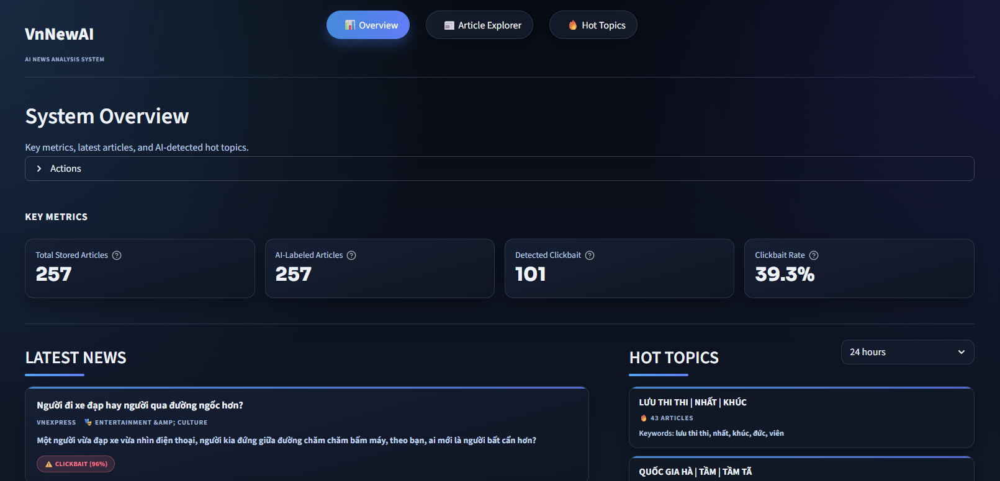

# 🗞️ AI News Content Analysis

Vietnamese news crawling, clickbait detection, hot-topic discovery, and dashboard analytics in one local-first pipeline. 🚀



## ✨ Highlights
- Crawl news from multiple Vietnamese sources.
- Normalize and store article data in SQLite.
- Label clickbait with a local transformer model (no LLM API).
- Detect hot topics with BERTopic.
- Explore everything through a Streamlit dashboard.

## 🧩 Tech Stack
- Python 3.10+
- SQLite
- Transformers (PhoBERT / other backbones)
- BERTopic
- Streamlit

## ⚙️ Setup
```bash
git clone https://github.com/Jade2308/ai-news-content-analysis.git
cd ai-news-content-analysis
python -m venv .venv
```

Windows:
```powershell
.venv\Scripts\Activate.ps1
```

macOS/Linux:
```bash
source .venv/bin/activate
```

Install dependencies:
```bash
pip install -r requirements.txt
```

Initialize database:
```bash
python main.py initdb
```

## 🚀 Quick Start
1. Train model once:
```bash
python src/models/train_clickbait.py
```
2. Crawl articles:
```bash
python main.py crawl-all
```
3. Label unlabeled articles:
```bash
python main.py label
```
4. Detect topics:
```bash
python main.py topics --hours 24 --top-n 10
```
5. Launch dashboard:
```bash
python main.py run --port 8501
```
Open: `http://127.0.0.1:8501` 🌐

## 🛠️ Main CLI Commands
```bash
python main.py run
python main.py auto
python main.py crawl-all
python main.py crawl-hourly
python main.py seed --source all --limit 50
python main.py label --batch-size 32
python main.py topics --hours 24 --top-n 10
python main.py topics-all
python main.py db-check
python main.py db-clean --days 14
```

## 📌 Notes
- `results/` is treated as regenerable output and is ignored by git.
- Topic naming is local keyword-based (no Gemini / no external LLM API).
- Default DB path is `data/news.db`.

## 🧯 Troubleshooting
- Missing model: run `python src/models/train_clickbait.py`.
- Empty metrics: run `crawl-all` then `label`.
- No topics found: increase `--hours` or ensure enough recent articles.

## 📚 Reference
Dataset/paper context:  
https://www.sciencedirect.com/science/article/pii/S2352340925008856