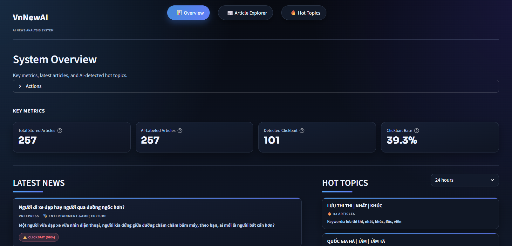

# 🗞️ AI News Content Analysis
Vietnamese news crawling, clickbait detection, hot-topic discovery, and dashboard analytics in one local-first Python pipeline.


## ✨ Features
- 📰 Crawl Vietnamese news articles from multiple sources.
- 🧹 Clean HTML, normalize metadata, and store structured records.
- 🗃️ Save articles, predictions, and topics in SQLite.
- 🤖 Train and run a local transformer clickbait classifier.
- 🔥 Detect emerging hot topics with BERTopic.
- 📊 Explore metrics, articles, and topics in Streamlit.

## 🧰 Tech Stack
- 🐍 Python 3.10+
- 🗄️ SQLite
- 🌐 Requests, BeautifulSoup, and lxml
- 🧠 PyTorch and Transformers
- 🔎 scikit-learn, BERTopic, UMAP, and HDBSCAN
- 📈 Pandas, NumPy, Matplotlib, and Streamlit

## 📦 Setup
Clone the project:
```bash
git clone https://github.com/Jade2308/ai-news-content-analysis.git
cd ai-news-content-analysis
```
Create a virtual environment:
```bash
python -m venv .venv
```
Activate it on Windows:
```powershell
.venv\Scripts\Activate.ps1
```
Activate it on macOS or Linux:
```bash
source .venv/bin/activate
```
Install dependencies:
```bash
pip install -r requirements.txt
```

## 🚀 Quick Start
Initialize the database:
```bash
python main.py initdb
```
Train the clickbait model:
```bash
python src/models/train_clickbait.py
```
Run the full local workflow:
```bash
python main.py auto
```
Launch only the dashboard:
```bash
python main.py run --port 8501
```
Open `http://127.0.0.1:8501` in your browser.

## 🛠️ Main Commands
```bash
python main.py crawl-all
python main.py crawl-hourly
python main.py seed --source all --limit 50
python main.py label --batch-size 32
python main.py topics --hours 24 --top-n 10
python main.py topics-all
python main.py db-check
python main.py db-query
python main.py db-clean --days 14
```
## 📁 Project Layout
- `main.py` is the main CLI launcher.
- `src/crawlers/` contains source-specific crawlers.
- `src/models/` contains training, evaluation, and inference code.
- `src/core/` contains cleaning, category, and topic utilities.
- `src/database/` contains SQLite schema and persistence helpers.
- `src/streamlit/` contains the dashboard UI.
- `data/news.db` is the default local database.
- `results/` stores generated models, plots, and reports.

## 🧪 Checks
```bash
python -m compileall main.py src
python -m pip check
python main.py db-check
```
## ⚠️ Troubleshooting
- Missing database: run `python main.py initdb`.
- Empty dashboard: run `python main.py crawl-all`, then `python main.py label`.
- Missing model: run `python src/models/train_clickbait.py`.
- No hot topics: crawl more articles or increase the `--hours` window.
- Busy Streamlit port: `main.py run` automatically tries another port.
📝 Note: The pipeline is local-first and does not require an external LLM API.
📚 Reference: https://www.sciencedirect.com/science/article/pii/S2352340925008856
